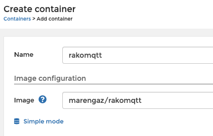
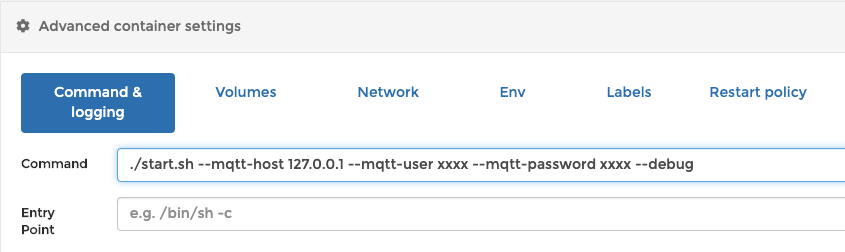
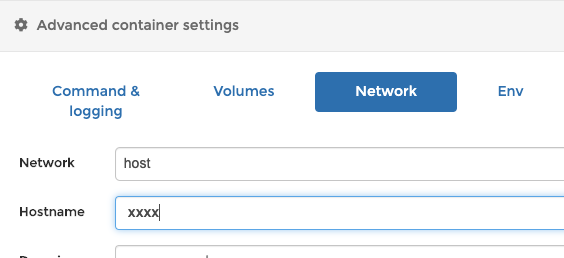

# rako mqtt

[![Test RakoMQTT][github-actions-shield]][github-actions]

[![Buy me a coffee][buymeacoffee-shield]][buymeacoffee]

## About

A component to attach rako lights (via the rako bridge) to an mqtt broker for use with home assistant.
[Rako bridge interaction guide](accessing-the-rako-bridge.pdf).

Only tested with [mosquitto](https://mosquitto.org/)

## Architecture

The docker container runs 2 processes

- `watcher` mode listens for the rako bridge to broadcast change of state updates, then posts a home assistant compatible message to your mqtt broker
- `commander` mode subscribes to the home assistant command topic and upon receiving a message, posts a command to the rako bridge via http


## Deploy

### Portainer
1. Install the [Home Assistant Portainer addon](https://github.com/hassio-addons/addon-portainer)
1. On the 'Containers' view, click  'Add Container'
    1. Name = rakomqtt
    1. Image = marengaz/rakomqtt

     

    1. in 'Advanced container settings' > 'Command & logging'
        1. Command = ./start.sh --mqtt-host <your_host_ip> --mqtt-user <your_username> --mqtt-password <your_password> --debug 

         

    1. in 'Advanced container settings' > 'Network'
        1. Network = host
        1. Hostname = <your_hostname>

         

1. Click the 'Deploy the container' button
1. The container should now launch and be viewable in the 'Containers' tab 


### Find your RA-BRIDGE
There are a bunch of different ways to do this:

1. Download this code and run `python3 -m rakomqtt.RakoBridge` 
2. Log into your router and trawl through the devices connected to your LAN
3. Open Rako smartphone app. Click 'Rako' > 'Advanced' > 'Diagnostics'
    1. See 'Connected IP'


### Identify your rooms

Visit http://<RA-BRIDGE-IP>/rako.xml.
This will present a list of all the rooms in your house along with their internal ids 

### Home assistant light config

Use the Home assistant [mqtt light platform](https://www.home-assistant.io/components/light.mqtt/). 
```yaml
- platform: mqtt
  name: <name of the room>
  schema: json
  state_topic: "rako/room/<rako-room-id>"
  command_topic: "rako/room/<rako-room-id>/set"
  brightness: true
```

For example
```yaml
- platform: mqtt
  name: Hallway
  schema: json
  state_topic: "rako/room/42"
  command_topic: "rako/room/42/set"
  brightness: true
```

## Dev

### Manual build and deploy:
SSH into your home assistant box and run this:

```bash
docker-compose -f docker-compose.yaml up -d --build
```

### Run

```bash
python -um rakomqtt
```


[buymeacoffee-shield]: https://www.buymeacoffee.com/assets/img/guidelines/download-assets-sm-2.svg
[buymeacoffee]: https://www.buymeacoffee.com/marengaz
[github-actions-shield]: https://github.com/marengaz/rakomqtt/workflows/Test%20RakoMQTT/badge.svg?branch=master
[github-actions]: https://github.com/marengaz/rakomqtt/actions?query=workflow%3A%22Test+RakoMQTT%22+branch%3Amaster
